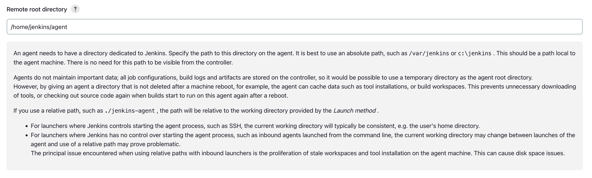
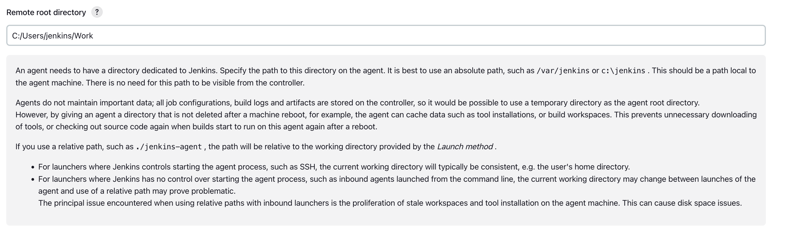
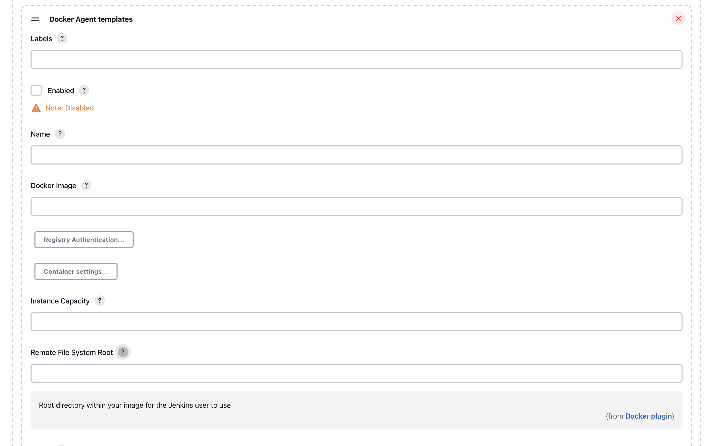
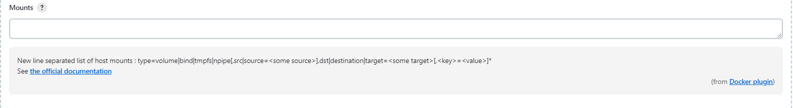

# Docker image for Jenkins agents connected over SSH

[](https://gitter.im/jenkinsci/docker?utm_source=badge&utm_medium=badge&utm_campaign=pr-badge&utm_content=badge)
[](https://github.com/jenkinsci/docker-ssh-agent)
[](https://hub.docker.com/r/jenkins/ssh-agent/)
[](https://github.com/jenkinsci/docker-ssh-agent/releases)

A [Jenkins](https://jenkins.io) agent image which allows using SSH to establish the connection.
It can be used together with the [SSH Build Agents plugin](https://plugins.jenkins.io/ssh-slaves) or other similar plugins.

See [Jenkins Distributed builds](https://wiki.jenkins-ci.org/display/JENKINS/Distributed+builds) for more info.

## Running

### Running with the SSH Build Agents plugin

To run a Docker container

```bash
docker run -d --rm --name=agent --publish 2200:22 -e "JENKINS_AGENT_SSH_PUBKEY=<public_key>" jenkins/ssh-agent
```

 - `-d`: To start a container in detached mode, use the `-d` option. Containers started in detached mode exit when the root process used to run the container exits, unless you also specify the --rm option.
 - `--rm`: If you use -d with --rm, the container is removed when it exits or when the daemon exits, whichever happens first.
 - `--name`: Assigns a name to the container. If you do not specify a name, Docker generates a random name.
 - `--publish 2200:22`: Publishes the host port 2200 to the agent container port 22 (SSH) to allow connection from the host with `ssh jenkins@localhost -p 2200`

Please note none of these options are mandatory, they are just examples.

You will then be able to connect this agent using the [SSH Build Agents plugin](https://plugins.jenkins.io/ssh-slaves) as "jenkins" with the matching private key.

When using the Linux image, you have to set the value of the `Remote root directory` to `/home/jenkins/agent` in the agent configuration UI.



When using the Windows image, you have to set the value of the `Remote root directory` to `C:/Users/jenkins/Work` in the agent configuration UI.



If you intend to use another directory than `/home/jenkins/agent` under Linux or `C:/Users/jenkins/Work` under Windows, don't forget to add it as a data volume.

```bash
docker run -v docker-volume-for-jenkins-ssh-agent:/home/jenkins/agent:rw jenkins/ssh-agent "<public key>"
```

### How to use this image with Docker Plugin

To use this image with [Docker Plugin](https://plugins.jenkins.io/docker-plugin), you need to pass the public SSH key using environment variable `JENKINS_AGENT_SSH_PUBKEY` and not as a startup argument.

In _Environment_ field of the Docker Template (advanced section), just add:

    JENKINS_AGENT_SSH_PUBKEY=<YOUR PUBLIC SSH KEY HERE>

Don't put quotes around the public key.

Please note that you have to set the value of the `Remote File System Root` to `/home/jenkins/agent` in the Docker Agent Template configuration UI.



If you intend to use another directory than `/home/jenkins/agent`, don't forget to add it as a data volume.



You should be all set.

## Extending the image
Should you need to extend the image, you could use something along those lines:

```Dockerfile
FROM jenkins/ssh-agent:debian-jdk17 as ssh-agent
# [...]
COPY --chown=jenkins mykey "${JENKINS_AGENT_HOME}"/.ssh/mykey
# [...]
```

## Configurations

The image has several supported configurations, which can be accessed via the following tags:

`${IMAGE_VERSION}` can be found on the [releases](https://github.com/jenkinsci/docker-ssh-agent/releases) page.

* `latest`, `latest-jdk11`, `jdk11`, `latest-bullseye-jdk11`, `bullseye-jdk11`, `latest-bookworm-jdk11`, `bookworm-jdk11`, `latest-debian-jdk11`, `debian-jdk11`, `${IMAGE_VERSION}`, `${IMAGE_VERSION}-jdk11`, ([Dockerfile](debian/Dockerfile))
* `latest-jdk17`, `jdk17`, `latest-bullseye-jdk17`, `bullseye-jdk17`, `latest-bookworm-jdk17`, `bookworm-jdk17`, `latest-debian-jdk17`, `debian-jdk17`, `${IMAGE_VERSION}-jdk17`, ([Dockerfile](debian/Dockerfile))
* `nanoserver-1809`, `nanoserver-ltsc2019`, `nanoserver-1809-jdk11`, `nanoserver-ltsc2019-jdk11`, `${IMAGE_VERSION}-nanoserver-1809`, `${IMAGE_VERSION}-nanoserver-ltsc2019`, `${IMAGE_VERSION}-nanoserver-1809-jdk11`, `${IMAGE_VERSION}-nanoserver-ltsc2019-jdk11` ([Dockerfile](windows/nanoserver-ltsc2019/Dockerfile))
* `windowsservercore-1809`, `windowsservercore-ltsc2019`, `windowsservercore-1809-jdk11`, `windowsservercore-ltsc2019-jdk11`, `${IMAGE_VERSION}-windowsservercore-1809`, `${IMAGE_VERSION}-windowsservercore-ltsc2019`, `${IMAGE_VERSION}-windowsservercore-1809-jdk11`, `${IMAGE_VERSION}-windowsservercore-ltsc2019-jdk11` ([Dockerfile](windows/windowsservercore-ltsc2019/Dockerfile))

## Building instructions

### Pre-requisites

Should you want to build this image on your machine (before submitting a pull request for example), please have a look at the pre-requisites:

* A GNU/Linux machine with [Docker](https://docs.docker.com/engine/install/), a macOS machine with [Docker Desktop](https://docs.docker.com/desktop/install/mac-install/), or a Windows machine with [Docker for Windows](https://docs.docker.com/docker-for-windows/) installed
* Docker BuildX plugin [installed](https://github.com/docker/buildx#installing) on older versions of Docker (from `19.03`). Docker Buildx is included in recent versions of Docker Desktop for Windows, macOS, and Linux. Docker Linux packages also include Docker Buildx when installed using the DEB or RPM packages.
* [GNU Make](https://www.gnu.org/software/make/) [installed](https://command-not-found.com/make)
* jq [installed](https://command-not-found.com/jq)
* [GNU Bash](https://www.gnu.org/software/bash/) [installed](https://command-not-found.com/bash)
* git [installed](https://command-not-found.com/git)
* curl [installed](https://command-not-found.com/curl)

### Building

#### Target images

If you want to see the target images that will be built, you can issue the following command:

```bash
make list
alpine_jdk11
alpine_jdk17
debian_jdk11
debian_jdk17
debian_next_jdk11
debian_next_jdk17
```

#### Building a specific image

If you want to build a specific image, you can issue the following command:

```bash
make build-<OS>_<JDK_VERSION>
```

That would give for JDK 11 on Alpine Linux:

```bash
make test-alpine_jdk11
```

#### Building all images
Then, you can build all the images by running:

```bash
make build
```

#### Testing all images

If you want to test the images, you can run:

```bash
make test
```
#### Testing a specific image

If you want to test a specific image, you can run:

```bash
make test-<OS>_<JDK_VERSION>
```

That would give for JDK 11 on Alpine Linux:

```bash
make test-alpine_jdk11
```

#### Other `make` targets

`show` gives us a detailed view of the images that will be built, with the tags, platforms, and Dockerfiles.

```bash
make show
{
  "group": {
    "default": {
      "targets": [
        "alpine_jdk17",
        "alpine_jdk11",
        "debian_jdk11",
        "debian_jdk17",
        "debian_next_jdk11",
        "debian_next_jdk17"
      ]
    }
  },
  "target": {
    "alpine_jdk11": {
      "context": ".",
      "dockerfile": "alpine/Dockerfile",
      "tags": [
        "docker.io/jenkins/ssh-agent:alpine-jdk11",
        "docker.io/jenkins/ssh-agent:latest-alpine-jdk11"
      ],
      "platforms": [
        "linux/amd64"
      ],
      "output": [
        "type=docker"
      ]
    },
    [...]
```

`bats` is a dependency target. It will update the [`bats` submodule](https://github.com/bats-core/bats-core) and run the tests.

```bash
make bats
make: 'bats' is up to date.
```

## Changelog

See [GitHub Releases](https://github.com/jenkinsci/docker-ssh-agent/releases/latest).
Note that the changelogs and release tags were introduced in Dec 2019, and there are no entries for previous releases.
Please consult with the commit history if needed.
